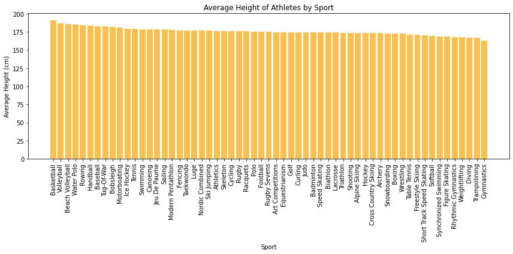

 Olympics Data Exploration

 

  

**Table of Contenst :**
- [Dataset :](#dataset-)
  - [Overview](#overview)
  - [Data Dictionary :](#data-dictionary-)
- [Data Exploration :](#data-exploration-)
  - [🗺️ **Explore**:](#️-explore)
  - [🔎 **Analyze** :](#-analyze-)
  - [📊 **Visualize** :](#-visualize-)

# Dataset :

This is a historical dataset on the modern Olympic Games, covering the period from Athens 1896 to Rio 2016. It provides information on individual athletes competing in Olympic events and the medals they won (if any).

## Overview

The Olympic Games dataset contains detailed information about athletes, including their names, gender, age, height, weight, team affiliation, National Olympic Committee (NOC), games' details (year, season, city), sports, events, and medals won (Gold, Silver, Bronze).

|      |   id | name                     | sex  |  age | height | weight | team           | noc  | games       | year | season | city      | sport         | event                            | medal |
| ---: | ---: | :----------------------- | :--- | ---: | -----: | -----: | :------------- | :--- | :---------- | ---: | :----- | :-------- | :------------ | :------------------------------- | :---- |
|    0 |    1 | A Dijiang                | M    |   24 |    180 |     80 | China          | CHN  | 1992 Summer | 1992 | Summer | Barcelona | Basketball    | Basketball Men's Basketball      | nan   |
|    1 |    2 | A Lamusi                 | M    |   23 |    170 |     60 | China          | CHN  | 2012 Summer | 2012 | Summer | London    | Judo          | Judo Men's Extra-Lightweight     | nan   |
|    2 |    3 | Gunnar Nielsen Aaby      | M    |   24 |    nan |    nan | Denmark        | DEN  | 1920 Summer | 1920 | Summer | Antwerpen | Football      | Football Men's Football          | nan   |
|    3 |    4 | Edgar Lindenau Aabye     | M    |   34 |    nan |    nan | Denmark/Sweden | DEN  | 1900 Summer | 1900 | Summer | Paris     | Tug-Of-War    | Tug-Of-War Men's Tug-Of-War      | Gold  |
|    4 |    5 | Christine Jacoba Aaftink | F    |   21 |    185 |     82 | Netherlands    | NED  | 1988 Winter | 1988 | Winter | Calgary   | Speed Skating | Speed Skating Women's 500 metres | nan   |

  ## Data Dictionary : 

   | Column | Explanation                    |
   | ------ | ------------------------------ |
   | id     | Unique number for each athlete |
   | name   | Athlete's name                 |
   | sex    | M or F                         |
   | age    | Age of the athlete             |
   | height | In centimeters                 |
   | weight | In kilograms                   |
   | team   | Team name                      |
   | noc    | National Olympic Committee 3   |
   | games  | Year and season                |
   | year   | Integer                        |
   | season | Summer or Winter               |
   | city   | Host city                      |
   | sport  | Sport                          |
   | event  | Event                          |
   | medal  | Gold, Silver, Bronze, or NA    |

[Source](https://www.kaggle.com/heesoo37/120-years-of-olympic-history-athletes-and-results) and [license](https://creativecommons.org/publicdomain/zero/1.0/) of the dataset.
The dataset is a consolidated version of data from [www.sports-reference.com](www.sports-reference.com). 

# Data Exploration : 

  ## 🗺️ **Explore**: 
  1. In which year and city did the Netherlands win the highest number of medals in their history?  
  💡 The Netherlands won the highest number of medals in their history in the year **1928** in the city of **Amsterdam**.
  
  2. Which country has won the highest number of medals in the history of the Olympic Games?  
   💡 The country with the highest number of medals in the history of the Olympic Games is: **United States**.

 3. Which athlete has won the highest number of gold medals in the Olympic Games, and what is the count of those gold medals?  
   💡 The athlete with the highest number of gold medals in the Olympic Games is: **Michael Fred Phelps**  
    The count of gold medals for this athlete is: **23 🥇**.
4. Who is the all-time leading medalist among female athletes in the Olympic Games, and what is the count of their medals, the country they represent, and the type of sport?  
 💡 The all-time leading medalist among female athletes in the Olympic Games is **Larysa Semenivna Latynina**, representing **Soviet Union**, in the sport of **Gymnastics**, with **18 🥇** .

 ## 🔎 **Analyze** :  

 1. Analyzing the medal counts for each team (country) : (top 5)  
   
   |      | team          | Bronze | Gold | Silver | Total |
   | ---: | :------------ | -----: | ---: | -----: | ----: |
   |  462 | United States |   1233 | 2474 |   1512 |  5219 |
   |  403 | Soviet Union  |    677 | 1058 |    716 |  2451 |
   |  165 | Germany       |    678 |  679 |    627 |  1984 |
   |  215 | Italy         |    484 |  535 |    508 |  1527 |
   |  171 | Great Britain |    572 |  519 |    582 |  1673 |

2. Analyzing the dominance of certain countries in specific sport and how many medals have they won?  
   
   **We choose : Athletics, Swimming, Fencing, Ice Hockey, and Basketball**  
   🏃 In the sport of *Athletics*, the dominant country is **United States** with 1071 🥇.  
   🏊 In the sport of *Swimming*, the dominant country is **United States** with 1066 🥇.  
   🤺 In the sport of *Fencing*, the dominant country is **Italy** with 359 🥇.  
   🏌️‍♂️ In the sport of *Ice Hockey*, the dominant country is **Canada** with 348 🥇.  
   ⛹️‍♀️ In the sport of *Basketball*, the dominant country is **United States** with 341 🥇.

## 📊 **Visualize** : 

1. Distribution of Medalists by Age : 
   
     

* Based on the provided results, it appears that the age distribution of medalists is as follows:
  *  Less than 20 years old: 65.7%
  *  20-29 years old: 18.2%
  *  30-39 years old: 13.2%
  *  40-49 years old: 2.2%
  *  50 years old and above: 0.7%  
  
    ⛳ The majority of medalists (65.7%) fall under the age of 20. This suggests that younger athletes have a higher chance of achieving success in the Olympic Games. It could be attributed to factors such as physical abilities, training intensity, and participation in youth development programs.

2. Medal Count Comparison by Gender : 
   
        

* Based on the analysis :
   * Male athletes accounted for a higher percentage of medalists (71.1%) compared to female athletes (28.3%). This indicates that historically, male athletes have been more successful in earning medals in the Olympic Games.

3. In which sports does the height of an athlete increase their chances of earning a medal?
   
        

  * Based on the analysis, it can be concluded that in sports such as basketball and volleyball, height plays a significant role in increasing an athlete's chances of earning a medal.

4.  Athletes' Performance by Season (Summer vs. Winter) :
   
      

   * Based on the analysis, it can be concluded that athletes tend to have a higher level of performance and dominance in the Summer Olympic Games compared to the Winter Olympic Games.

For more : 

